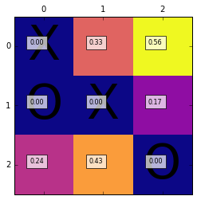

# Tic-Tac-Toe (XO)
> An Example of Dynamic Programming for 
> Making Decision in Zero-Sum Games

Tic-Tac-Toe or XO is one of the classic zero-sum games in artificial intelligence. Because number of states in this game is limited (still a high number), we can solve this problem using DP (Dynamic Programming).

This code, first generates all possible XO games through a simulation (please see the Step1 code). At this step, it generated a Q table for all possible games. The Q table lets computer to choose the best action based on your actions so far to increase its chance of winning. When the Q table is generated, the rest is just looking up at the table and find the best next action and state.

## Running the Code

Please run the codes in this program via Jupyter Notebook. This program consists of two codes:

#### 1) XO_Step1_Generating_Vlid_Games.ipynb

This code only generated a csv file of all valid tic-tac-toe games. You don't need to run this code if "valid_XO_games.csv", "State_Action_Reward_Table.csv", and "Qtable_for_XO.csv exist". BE CAREFUL, this code might takes hours and too much power from your computer.

#### 2) XO_Step2_Playing.ipynb

This is the code that interacts with human player. For better user experience, this part of the code is still under development.